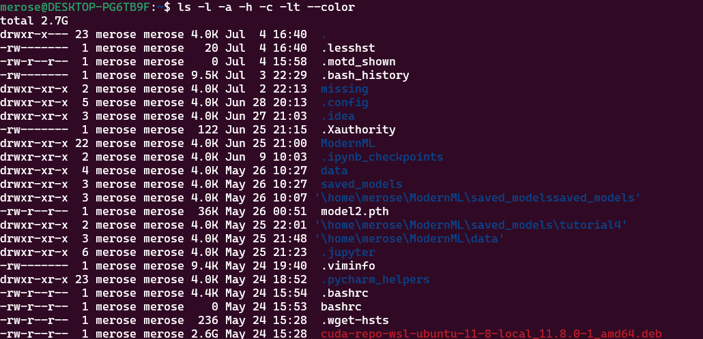

注意空格

单双引号

`""`会替换变量值

命令替换/进程替换

后者将结果输出到临时文件，将命令替换成临时文件名

```shell
$ foo=$(pwd)
$ foo=<(CMD)
```

## 通配符

```shell
$ ls *.sh
$ ls project?
```

大括号`{}`-一系列指令的公共子串

```shell
$ convert image.{jpg,png}
$ convert image.jpg image.png
```

## 脚本

```
#!
```

脚本开头`#!...`称为*shebang*,shell通过它了解程序如何运作

## shellcheck

warning；语法错误

## tools

### 命令手册：man/tldr

### 查找文件：find/fd/locate

```shell
$ find . "*.tmp" -exec rm {} \
```

### 查找内容：grep/ripgrep

### 查找命令：history/Ctrl+R/fish

执行命令历史	

后者倒序搜索历史命令

fish动态搜索命令

### 文件夹目录：tree/broot/nnn

目录结构

broot:增加模糊匹配

## practice

1. ```shell
	按照顺序
	$ ls -l -a -h -c -lt --color
	```

	

2. 使用一个环境变量来储存`marco`执行结果

	```shell
	# marco.sh
	marco(){
		echo $(pwd)
	}
	```

	```shell
	# polo.sh
	polo(){
		cd $1
	}
	```

	加载执行

	```shell
	merose@DESKTOP-PG6TB9F:~/missing$ source marco.sh
	merose@DESKTOP-PG6TB9F:~/missing$ source polo.sh
	merose@DESKTOP-PG6TB9F:~/missing$ foo=$(marco)
	merose@DESKTOP-PG6TB9F:~/missing$ cd ..
	merose@DESKTOP-PG6TB9F:~$ polo $foo
	merose@DESKTOP-PG6TB9F:~/missing$
	```

3. 这道题稍微有些麻烦，需要将源脚本的标准输出和标准错误流同时重定向到文件,这里的写法是`command >> out.txt 2>&1`；另外设置一个变量来记录正确执行的次数，在循环内`if`语句来判断正确执行与否

	```shell
	# caller.sh
	#!/usr/bin/env bash
	total=0
	while ./wrgchk.sh >> out.txt 2>&1; do
		if [[ $? -eq 0 ]]; then
			total=`expr $total + 1`
		fi
	done
	echo "$total" >> out.txt
	```

	执行结果

	```bash
	merose@DESKTOP-PG6TB9F:~/missing$ ./caller.sh
	merose@DESKTOP-PG6TB9F:~/missing$ cat out.txt
	Everything went according to plan
	Everything went according to plan
	Everything went according to plan
	Everything went according to plan
	Everything went according to plan
	Something went wrong
	The error was using magic numbers
	5
	```

4. ```shell
	$ find . -type f -name "*.html" -print0 | tar --null -czf "output.tar.gz" -T -
	```

	- `'-print0'` 选项用于输出文件名，并使用 null 字符分隔以处理文件名中包含空格的情况。
	- `tar --null -czf "output..tzr.gz" -T -` 中的 `--null` 选项用于接收 null 分隔的文件名列表。
	- `-czf` 选项用于创建一个压缩的 tar 文件，并指定 `"$output_file"` 作为输出文件名。
	- `-T -` 选项用于从标准输入读取文件名列表。它和`-T`类似，但前者是从标准输入流中获取文件名列表，后者则是从一个文件中获取，也就是需要`-T filename`

​	第二种方法则是使用`xargs`命令将`find`结果转换成命令行参数传给`tar`命令

```shell
$ find . -type f -name "*.html" -print0 | xargs -0 tar -czf "output2.tar.gz"
```

- `xargs -0`对应`-print0`,将null作为分隔符

5. 第一次使用`find [-option] -exec`，但是结果如下

	```shell
	merose@DESKTOP-PG6TB9F:~/missing$ find -atime -1 -exec ls -lt {} \;
	total 1692
	-rw-r--r-- 1 merose merose 290196 Jul  5 20:19  output2.tar.gz
	-rw-r--r-- 1 merose merose 290196 Jul  4 22:29  output.tar.gz
	-rw-r--r-- 1 merose merose 836547 Jul  4 22:15  1.html
	-rw-r--r-- 1 merose merose 276563 Jul  4 22:15 '2 3.html'
	-rwxr-xr-- 1 merose merose    153 Jul  4 21:55  caller.sh
	-rw-r--r-- 1 merose merose    227 Jul  4 21:48  out.txt
	-rwxr-xr-- 1 merose merose    205 Jul  4 18:07  wrgchk.sh
	-rw-r--r-- 1 merose merose     18 Jul  4 17:19  polo.sh
	-rw-r--r-- 1 merose merose     26 Jul  4 17:13  marco.sh
	-rw-r--r-- 1 merose merose     37 Jul  2 22:19  last-modified.txt
	-rwxr-xr-- 1 merose merose     51 Jul  2 22:09  semester
	-rw-r--r-- 1 merose merose      6 Jul  2 21:19  hello.txt
	-rw-r--r-- 1 merose merose 290196 Jul  5 20:19 ./output2.tar.gz
	-rw-r--r-- 1 merose merose 290196 Jul  4 22:29 ./output.tar.gz
	-rw-r--r-- 1 merose merose 276563 Jul  4 22:15 './2 3.html'
	-rw-r--r-- 1 merose merose 836547 Jul  4 22:15 ./1.html
	-rw-r--r-- 1 merose merose 227 Jul  4 21:48 ./out.txt
	-rwxr-xr-- 1 merose merose 153 Jul  4 21:55 ./caller.sh
	```

	`out.txt`和`./out.txt`实际上指向同一个文件，但是在结果中出现了两次，说明这样使用`-exec`实际上会将两个命令(find/ls)的结果连接在一次，并不会将find的结果传给ls再进行排序

	所以直接使用管道

	```shell
	$ find . -atime -1 | ls -lt
	total 1692
	-rw-r--r-- 1 merose merose 290196 Jul  5 20:19  output2.tar.gz
	-rw-r--r-- 1 merose merose 290196 Jul  4 22:29  output.tar.gz
	-rw-r--r-- 1 merose merose 836547 Jul  4 22:15  1.html
	-rw-r--r-- 1 merose merose 276563 Jul  4 22:15 '2 3.html'
	-rwxr-xr-- 1 merose merose    153 Jul  4 21:55  caller.sh
	-rw-r--r-- 1 merose merose    227 Jul  4 21:48  out.txt
	-rwxr-xr-- 1 merose merose    205 Jul  4 18:07  wrgchk.sh
	-rw-r--r-- 1 merose merose     18 Jul  4 17:19  polo.sh
	-rw-r--r-- 1 merose merose     26 Jul  4 17:13  marco.sh
	-rw-r--r-- 1 merose merose     37 Jul  2 22:19  last-modified.txt
	-rwxr-xr-- 1 merose merose     51 Jul  2 22:09  semester
	-rw-r--r-- 1 merose merose      6 Jul  2 21:19  hello.txt
	```

	

