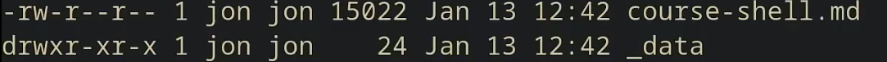
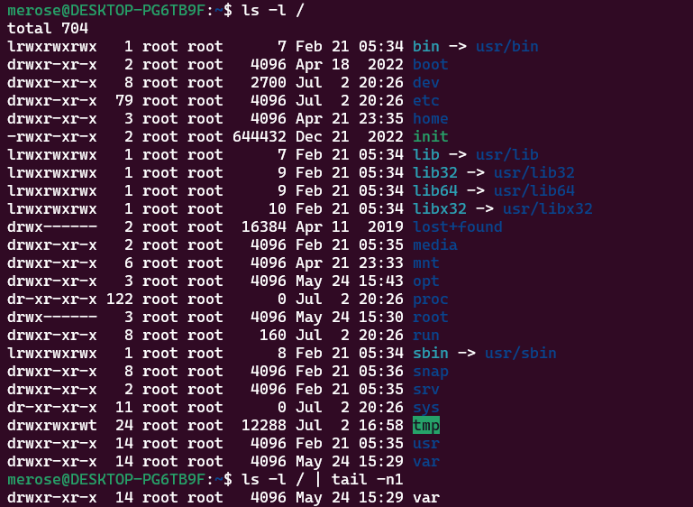

```shell
ls -l
```

`listing file using long format`



目录-所有者权限-拥有文件用户组权限-其他人权限(3字母为一组)

`x`-执行权限；对目录来说可以理解为搜索目录、进入目录的权限

```shell
mv # rename or move`
```

```shell
rm
rmdir
```


```shell
man #manual pages
```

```shell
Ctrl+L #clear terminal
```

## stream

```shell
> #redirect input stream
$ ehco hello > hello.txt	
< # redirect output stream
$ cat < hello.txt
$ cat < hello.txt > hello2.txt # copy file not using cp
>> # append
$ cat < hello.txt >> hello2.txt
```

## pipes

```shell
# 左侧的输出作为右侧的输入
$ | 
```

`tail`能够将输入倒数n行的内容输出

```shell
$ ls -l / | tail -n1
```



## root

```shell
$ sudo echo 500 > brightness
Permission denied
```

`|`、`>`、和 `<` 是通过 shell 执行的，而不是被各个程序单独执行。 `echo` 等程序并不知道 `|` 的存在，它们只知道从自己的输入输出流中进行读写

*shell*在`sudo echo`前尝试打开brightness

special for `tee`：将输入同时写入文件和output stream中，可以同时查看输入内容并且将输入保存到文件中

```shell
$ echo 500 | suod tee brightness
```

 ## practice

```shell
$ man touch
$ touch semester
$ echo '#!/bin/sh' > semester
$ echo curl --head --silent https://missing.csail.mit.edu > semester
$ ./semester
-bash: ./semester: Permission denied
# 修改权限
$ chmod u+x,g+x semester
$ ls -l
total 8
-rw-r--r-- 1 merose merose  6 Jul  2 21:19 hello.txt
-rwxr-xr-- 1 merose merose 51 Jul  2 22:09 semester
$ ./semester
HTTP/2 200
....
date: Sun, 02 Jul 2023 14:11:47 GMT
....
# 使用grep命令搜索date行
$ ./semester | grep ^date > last-modified.txt
$ cat last-modified.txt
date: Sun, 02 Jul 2023 14:19:01 GMT
```